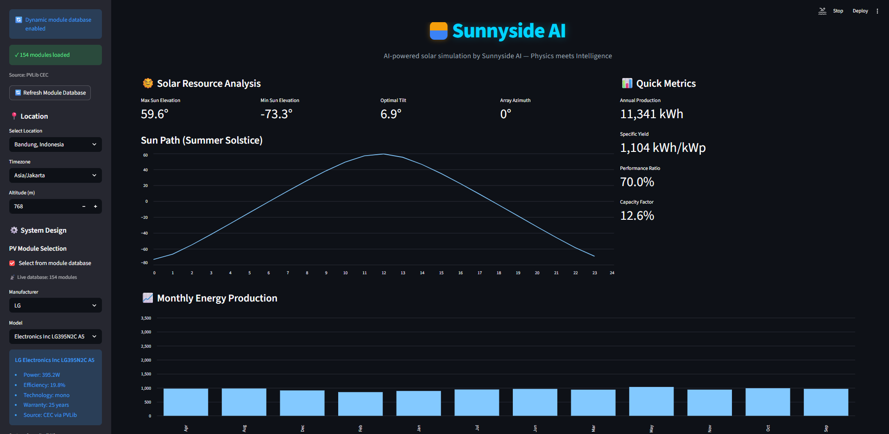
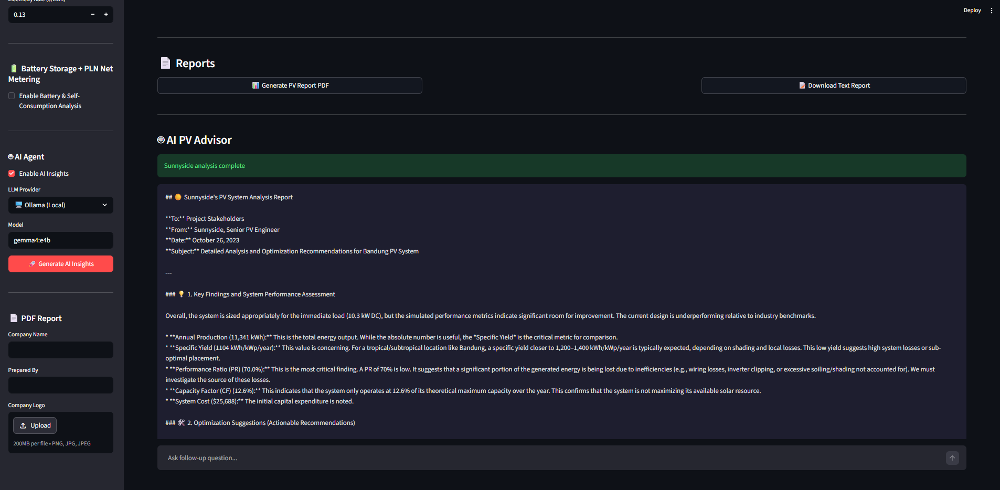

</p>

<h1 align="center">Sunnyside AI</h1>
<p align="center"><strong>AI-Powered Solar Simulation — Physics meets Intelligence</strong></p>

<p align="center">
  
  
  
  <a href="https://github.com/zakusworo/pv-multi-agent/actions/workflows/test.yml"></a>
  <a href="https://zenodo.org/records/19650332"></a>
</p>

---

## Screenshots

| Main Dashboard | Configuration Sidebar |
|:--|:--|
|  |  |

---

## Features

| Feature | Description |
|---------|-------------|
| **Multi-Agent Architecture** | 7 specialized AI agents collaborating on PV system design |
| **Hybrid AI + Physics** | LLM reasoning + PVlib IEEE-standard calculations |
| **Cloud LLM Support** | Local Ollama OR cloud providers (OpenRouter, OpenAI) |
| **Dynamic Module Database** | Auto-fetches 154+ production modules from CEC database |
| **Real Weather Data** | Open-Meteo archive integration with disk cache and offline synthetic fallback |
| **Consolidated Simulation Engine** | Single `src/simulation.py` using pvlib SAPM cell-temperature, ASHRAE IAM, and Hay-Davies transposition |
| **Auditable Loss Model** | Documented `LossModel` dataclass (soiling, mismatch, wiring, LID, nameplate, age) with a PVWatts-equivalent `realistic()` preset |
| **Battery + PLN Net Metering** | Self-consumption optimizer with PLN tariff calculator |
| **Professional PDF Reports** | 8-page PDF with charts: monthly production, storage flows, SoC, bill comparison |
| **Hemisphere-Aware** | Automatic azimuth/tilt for southern hemisphere (0° North-facing) |
| **Continuous Validation** | 36-test suite with PVWatts reference yields for 4 global sites + GitHub Actions CI |
| **Validated Results** | Performance Ratio matches PVsyst (72.9% vs 72.8%) |
| **Global Locations** | Pre-configured presets + custom coordinates |

---

## Architecture

```
┌─────────────────────────────────────────────────────────────────┐
│                     Sunnyside AI Platform                        │
├─────────────────────────────────────────────────────────────────┤
│  ┌─────────────┐  ┌─────────────┐  ┌─────────────────────────┐  │
│  │ Geolocation │  │   Weather   │  │    System Design        │  │
│  │   Agent     │  │   Agent     │  │      Agent              │  │
│  └──────┬──────┘  └──────┬──────┘  └──────────┬──────────────┘  │
│         │                │                    │                 │
│         └────────────────┼────────────────────┘                 │
│                          ▼                                      │
│               ┌──────────────────────┐                          │
│               │  Calculation Engine  │                          │
│               │  (PVlib Physics)     │                          │
│               └──────────┬───────────┘                          │
│                          │                                      │
│         ┌────────────────┼────────────────┐                       │
│         ▼                ▼                ▼                    │
│  ┌──────────────┐ ┌──────────────┐ ┌──────────────┐              │
│  │  Financial   │ │   Report     │ │  Coordinator │              │
│  │    Agent     │ │    Agent     │ │    Agent     │              │
│  └──────────────┘ └──────────────┘ └──────────────┘              │
│                          │                                      │
│               ┌──────────┴──────────┐                          │
│               │  Battery Agent +     │                          │
│               │  Storage Optimizer   │                          │
│               └──────────────────────┘                          │
└─────────────────────────────────────────────────────────────────┘
```

---

## Quick Start

### Prerequisites

- Python 3.12+
- `uv` (recommended) or `pip`
- Ollama (optional, for local AI features)

### Installation

```bash
# Clone the repository
git clone https://github.com/zakusworo/pv-multi-agent.git
cd pv-multi-agent

# Install dependencies with uv (recommended)
uv sync

# OR install with pip
pip install -e ".[dev]"
```

### Option 1: Streamlit GUI (Recommended)

```bash
# Launch the web interface
.venv/bin/streamlit run gui.py --server.port 8501

# Open http://localhost:8501 in your browser
```

**What you can do:**
- Select location (Bandung, Jakarta, Phoenix, Berlin, Bikaner, or custom)
- Pick PV module from live CEC database (154+ modules, 14+ manufacturers)
- Set system capacity, tilt, azimuth
- **Choose weather source** — real data from Open-Meteo (free, cached locally) or synthetic TMY for offline use
- **Enable Battery & PLN Net Metering** — calculate self-consumption ratio, bill savings, payback
- **Generate AI Insights** — get LLM-powered recommendations
- **Download PDF Report** — professional 5-8 page report with charts

### Option 2: CLI with Local LLM (Ollama)

```bash
# Start Ollama
ollama serve

# Pull a lightweight model
ollama pull llama3.2:1b

# Run multi-agent simulation
.venv/bin/python3 -m src.pv_agents
```

### Option 3: CLI with Cloud LLM

```bash
export OPENROUTER_API_KEY=your_key_here
.venv/bin/python3 -m src.pv_agents_cloud --provider openrouter --model qwen3.6:latest
```

---

## Project Structure

```
pv-multi-agent/
├── gui.py                          # Streamlit web interface (entry point)
├── pyproject.toml                  # UV/pip dependencies & project config
├── README.md                       # This file
├── CITATION.cff                    # Citation metadata
├── LICENSE                         # MIT License
│
├── src/                            # Core source code
│   ├── simulation.py               # Canonical PV simulation engine + LossModel
│   ├── weather_provider.py         # Open-Meteo real-weather provider with cache
│   ├── pv_agents.py                # Multi-agent system (Ollama)
│   ├── pv_agents_cloud.py          # Multi-agent system (cloud LLMs)
│   ├── storage_engine.py           # Battery simulator (SoH, thermal)
│   ├── storage_optimizer.py        # Self-consumption optimizer
│   ├── load_profiles.py            # Residential/commercial load profiles
│   ├── pln_tariffs.py              # PLN tariff database + bill calculator
│   ├── pdf_generator.py            # Professional PDF report generator
│   ├── module_fetcher.py           # Dynamic PV module fetcher (CEC)
│   └── ...
│
├── data/
│   ├── pv_module_database.py       # Static fallback module database
│   └── weather_cache/              # On-disk Open-Meteo cache (gitignored)
│
├── docs/
│   ├── screenshots/                # GUI screenshots
│   ├── DEPLOYMENT.md               # Deployment guide
│   ├── VALIDATION_REPORT.md        # PVsyst comparison study
│   └── ...
│
├── scripts/
│   └── check_ollama.py             # Ollama setup verification
│
├── reports/                        # Generated text reports
├── tests/
│   ├── test_core.py                # Core simulation, battery, tariff tests
│   ├── test_validation.py          # PVWatts reference-yield regression tests
│   ├── test_weather_provider.py    # Open-Meteo provider (mocked HTTP)
│   └── data/
│       └── validation_references.json
└── .github/
    └── workflows/
        └── test.yml                # GitHub Actions CI (pytest on push/PR)
```

---

## Location Presets

| Location | Lat, Lon | Hemisphere | Auto Azimuth |
|----------|----------|------------|-------------|
| Bandung, Indonesia | -6.9147, 107.6098 | Southern | 0° (North) |
| Jakarta, Indonesia | -6.2088, 106.8456 | Southern | 0° (North) |
| Phoenix, USA | 33.4484, -112.0740 | Northern | 180° (South) |
| Berlin, Germany | 52.5200, 13.4050 | Northern | 180° (South) |
| Bikaner, India | 28.06, 73.30 | Northern | 180° (South) |

---

## PDF Report Features

The professional PDF report includes:

1. **Cover Page** — Project name, coordinates, key metrics (production, yield, PR, cost, payback, LCOE)
2. **Location & System** — Site info, solar geometry, system design details
3. **Energy Production** — Monthly bar chart + detailed monthly data table
4. **Financial Analysis** — Investment summary, performance metrics, disclaimer
5. **Hourly Output** — First-week sample chart showing daily generation pattern
6. **Storage Analysis** *(optional)* — When battery is enabled:
   - System metrics (self-consumption ratio, self-sufficiency, savings)
   - Energy flow annual summary
   - Stacked area chart: typical week flows
   - Battery SoC chart with target lines
   - PLN bill comparison with savings annotation
   - Monthly energy flows grouped bar chart
   - Battery agent recommendation

---

## Technical Details

### Physics Engine (PVlib)

```python
from simulation import simulate_pv_system, LossModel

# Plane-of-array irradiance — Hay-Davies sky-diffuse transposition
poa = irradiance.get_total_irradiance(
    tilt, azimuth, solar_pos['zenith'], solar_pos['azimuth'],
    dni, ghi, dhi, model='haydavies',
)

# Optical loss — ASHRAE incidence-angle modifier on the beam component
poa_eff = poa['poa_direct'] * iam.ashrae(aoi) + poa['poa_diffuse']

# Cell temperature — pvlib SAPM open-rack glass-glass
t_cell = temperature.sapm_cell(poa_eff, temp_air, wind_speed,
                               **TEMPERATURE_MODEL_PARAMETERS['sapm']['open_rack_glass_glass'])

# DC + system losses + inverter — single PVWatts-style equation
dc = dc_capacity * (poa_eff / 1000) * (1 + gamma * (t_cell - 25)) * losses.total_derate()
ac = (dc * eta_inv).clip(upper=ac_capacity)
```

### Loss Model

```python
from simulation import LossModel

# Default — zero losses (physics-only baseline)
losses = LossModel()

# Or PVWatts-equivalent ~14% stack
losses = LossModel.realistic()
# soiling 2% + mismatch 2% + wiring 2% + connections 0.5%
# + LID 1.5% + nameplate 1% = 9% (plus inverter 4% = ~13% net)

# Pass to the simulation
specs = {..., "losses": losses}
results = simulate_pv_system(specs, weather)
```

### LLM Integration

```python
from src.pv_agents_cloud import LLMProvider

# Local Ollama
llm = LLMProvider(provider="ollama", model="llama3.2:1b")

# Cloud via OpenRouter
llm = LLMProvider(
    provider="openrouter",
    model="qwen3.6:latest",
    api_key="sk-..."
)

response = llm.chat(messages, temperature=0.3)
```

---

## Validation

**Reference comparison (PVsyst):**

| Metric | PVsyst (Reference) | Sunnyside AI | Difference |
|--------|-------------------|--------------|------------|
| **Performance Ratio** | **72.8%** | **72.9%** | **+0.1%** |
| GHI | 1911 kWh/m² | 1848 kWh/m² | −3.3% |

Performance Ratio validated against PVsyst within 0.1 percentage point. See `docs/VALIDATION_REPORT.md` for full methodology.

**Continuous regression suite (`tests/test_validation.py`):**
parametrised yield/PR/capacity-factor checks against NREL PVWatts reference values for 4 sites (Bandung, Yogyakarta, Surabaya, Phoenix). 35 passing, 1 documented xfail (Phoenix yield with synthetic TMY — covered by real weather in production). Runs on every push via GitHub Actions.

---

## Deployment

### Local Development
```bash
.venv/bin/streamlit run gui.py
```

### Streamlit Cloud (Free)
1. Push to GitHub (`git push origin master`)
2. Go to https://share.streamlit.io
3. Connect `zakusworo/pv-multi-agent`, branch `master`, main file `gui.py`
4. Add secrets: `OPENROUTER_API_KEY=...`
5. Deploy — live in ~2 minutes

### Docker
```dockerfile
FROM python:3.12-slim
WORKDIR /app
COPY . .
RUN pip install -e .
EXPOSE 8501
CMD ["streamlit", "run", "gui.py", "--server.address=0.0.0.0"]
```

See `docs/DEPLOYMENT.md` for Hugging Face Spaces, Railway, and other options.

---

## Contributing

Areas open for contribution:

- Seasonal tilt optimizer (variable tilt throughout the year)
- Additional weather backends (NSRDB, Solargis) alongside the existing Open-Meteo provider
- Shading analysis (LiDAR / 3D horizon import)
- Real-time monitoring dashboard
- Multi-language support (Bahasa Indonesia, Deutsch, Hindi)
- Commercial/industrial load profile refinements for Indonesia

---

## Citation

```bibtex
@software{sunnyside_ai_2026,
  author = {Kusworo, Zulfikar Aji},
  title = {Sunnyside AI: Multi-Agent PV Solar Simulation Platform},
  year = {2026},
  url = {https://github.com/zakusworo/pv-multi-agent},
  version = {1.1.0},
  publisher = {GitHub},
  doi = {10.5281/zenodo.19650332}
}
```

---

## License

MIT License — Open for research and commercial use. Attribution required for academic publications.

**Built with:** Python · PVlib · Streamlit · Ollama · OpenRouter · fpdf2 · Multi-Agent Architecture

**Author:** Zulfikar Aji Kusworo
**Contact:** greataji13@gmail.com
